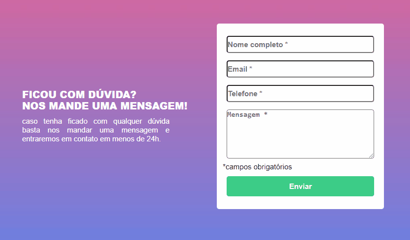

# FORMULÁRIO COM VALIDAÇÃO 💻

Quest do módulo de JavaScript Intermediário do curso DevQuest do Dev em Dobro. No exercício, o formulário deve ter todos os campos preenchidos para ser validado, quando um ou mais campos forem preenchidos e o botão for clicado a borda fica com a cor verde, por outro lado, os campos não preenchidos ficam com a borda vermelha e uma mensagem de erro aparece abaixo do campo.

### Imagem do Formulário 👌

### Links

- Formulário ao vivo: [https://vitorlopes523.github.io/formulario-com-validacao/]
- URL do código no GitHub: [https://github.com/vitorlopes523/formulario-com-validacao]

## Meu processo

### Construído com

- Marcação semântica HTML5
- Propriedades personalizadas CSS
- Flexbox
- Linguagem de programação JavaScript

### Dificulades

- Percorrer todos os elementos com JavaScript.
- Adicionar e remover as classes para mudar a cor da borda dos campos se eles tivessem preenchidos ou não.
- Adicionar a mensagem de erro abaixo dos campos não preenchidos.

### Desenvolvimento contínuo

- Aprimorar ainda mais conhecimento em HTML e sua semântica.
- Aprimorar sobre as propriedades de CSS, principalmente flexbox e grid.
- Aprender a base do JavaScript.
- Ter conhecimento do JavaScript avançado.
- Aprender e aperfeiçoar o framework React.
- Desenvolver técnicas que melhore meu status como profissional.
- Seguir evoluindo.

Espero que tenha gostado!🙂